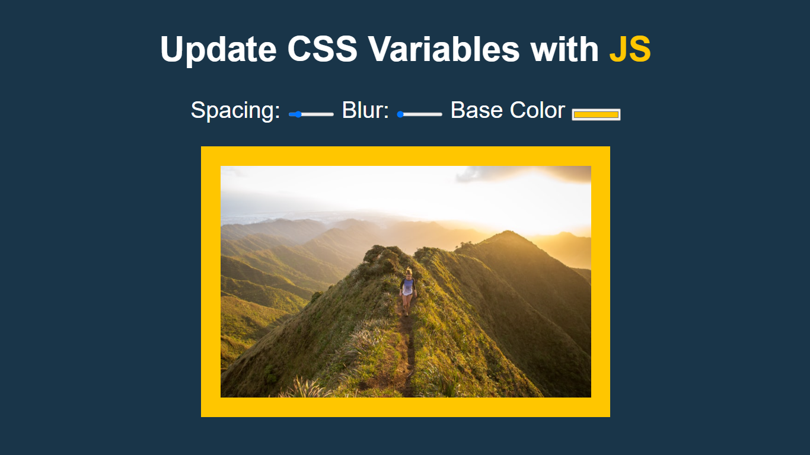

# JS-30-DAY-3
## day 3

<h1 align="center"> Update CSS Variables with JS </h1>

> I learned how to handle CSS variables and how to changes them using JS and make use of data attribute and dataset.

##

### ✨ [Click for Demo](https://cenacrharsh.github.io/JS-30-DAY-3/)

##



## Features & Usage

```sh
- You can control the spacing,blur and base color and image using CSS variables.
- How to Change CSS variables via JS.
- Use data attribute and dataset.
```
